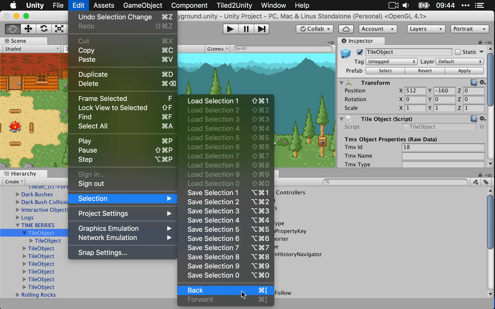

# Selection History Navigator

This is a Unity editor extension that adds web browser-style **Back** and
**Forward** items to the *Edit > Selection* menu. These allow you to quickly
re-select the game object or asset that you previously had selected.

## Using

Drop the *SelectionHistoryNavigator.cs* file into your project. After clicking
on a few game objects or assets, press <kbd>command</kbd> <kbd>[</kbd> (macOS)
or <kbd>ctrl</kbd> <kbd>[</kbd> (Windows) to return to the previous selection.

After navigating backward, you can also navigate forward with
<kbd>command</kbd> <kbd>]</kbd> (macOS) or <kbd>ctrl</kbd> <kbd>]</kbd>
(Windows).
